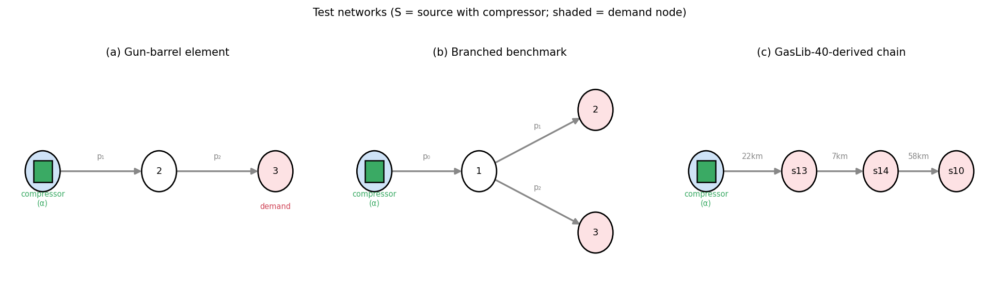

# Safety-Constrained Deep Reinforcement Learning for Cost-Optimal Dynamic Compressor Dispatch under Time-of-Use Electricity Prices

*(Working title — preliminary working draft. All numbers are real, from a reduced-scale run of `run_experiments.py`; see the integrity note under the abstract.)*

---

## Abstract

Electric-driven compressor stations let gas transmission operators shift compression
work in time, using the pipeline's own line-pack as a short-term energy buffer to
exploit time-of-use (TOU) electricity tariffs. Realising this flexibility online is hard:
the dispatch must respect strongly nonlinear compressor characteristics and a tight
operating envelope (speed limits, surge/choke) while reacting to uncertain demand and
price. Existing deep-reinforcement-learning (DRL) work on gas networks either optimises a
*steady-state* single-step decision or abstracts the gas side to algebraic constraints,
so the coupling between detailed compressor physics and economic, dynamic dispatch is
left open. We formulate the problem as a 24-hour **constrained Markov decision process
(CMDP)** over a dynamic line-pack model with TOU pricing, embedding the paper-style
centrifugal-compressor maps (adiabatic head, head/efficiency polynomials) and the full
operating envelope as state-dependent constraints, and we release a single-source-of-truth
physics implementation shared by the environment and the planning baselines. A central
finding concerns *how the action is realised*: because the compressor's feasible set is
**disconnected** (off, or on above a state-dependent minimum speed), a continuous policy
otherwise persistently commands the infeasible "dead band" and incurs ≈6 envelope
violation-hours per day **regardless of training budget**. Realising dead-band commands as
the unit staying off makes the action map onto the feasible set and turns the problem
tractable: every trained agent then reaches **zero** envelope violations. We benchmark a
rule-based heuristic, a genetic algorithm (GA), a dynamic-programming (DP) reference, a
receding-horizon MPC, and four DRL agents (SAC, TD3, PPO, and a **Lagrangian / constrained
SAC**) on a common objective. With feasibility secured, the model-based optimisers (GA, DP,
MPC) are near-optimal (24-h cost ≈5.4); model-free DRL is **feasible and far cheaper to
deploy but pays a cost premium** (≈2–3× the optimum). Among DRL agents, **constraint-aware
SAC is the most reliable** — lower 24-h cost and markedly lower seed variance than vanilla
penalty-reward SAC, with the tightest terminal-inventory compliance. Learned policies act in
≈5 ms — ≈200× faster than the MPC feedback law and ≈2300× faster than the GA — and, trained under
noise, stay the *most* feasible across perturbed demand/price scenarios (≈0 vs 0.5–1.3
violation-hours for the grid-DP/MPC/GA). **Crucially, distilling the MPC controller into a
millisecond MLP** (behavioral cloning + DAgger) **closes the cost premium**: it matches — indeed
slightly undercuts — the MPC cost (5.13 ± 0.4 vs 5.38) at near-feasibility (≈0.4 violation-hours)
and ≈2.5 ms (≈430× faster than the MPC law), showing that the effective route to a
fast near-optimal feasible controller here is to *distill a model-based controller*, not to train
model-free RL from scratch. The contributions are the physics-faithful CMDP formulation, the
feasibility-aware action realisation that makes DRL tractable here, the constraint-aware method,
the distillation result, and a fair, reproducible benchmark that quantifies both the promise
(feasibility + real-time latency) and the limits (from-scratch RL's cost premium) of learned
control for line-pack economic dispatch. We validate on **three topologies** — a gun-barrel element,
a branched benchmark, and a sub-network with **native pipe geometry from the real GasLib-40
instance** — and find the core results (feasibility-aware action realisation, feasible from-scratch
DRL, MPC distillation) transfer; on the GasLib-40 network the distilled controller is the best
learned method outright (matching the continuous optimum at zero violations and millisecond
latency). The ranking among the from-scratch DRL agents is network-dependent.

**Keywords:** natural gas pipeline; line-pack flexibility; time-of-use pricing; compressor
optimisation; deep reinforcement learning; constrained MDP; soft actor–critic.

> **Status / integrity note.** All numbers are from a *reduced-but-real* run
> (`run_experiments.py --steps 150000 --seeds 5 --perturb 6 --lr 3e-4`; 5 seeds on the gun-barrel,
> 3 on the benchmark networks):
> genuine, not illustrative, but at a modest budget — not camera-ready. A one-flag scale-up is
> provided. The DP/MPC references use a 121×101 grid (the finest that stays feasible; see §6).

---

## 1. Introduction

Natural gas remains a backbone of the energy transition, and the electrification of
compressor drivers couples gas transmission to the power system at the operational
timescale. When a compressor is electrically driven and the operator faces a TOU
electricity tariff, there is an economic incentive to **shift compression work to
low-price hours** and ride out high-price hours on stored line-pack — the mass of gas held
in the pipe, which acts as a distributed, fast short-term store. Capturing this value
online is a constrained, dynamic optimal-control problem: the controller must keep node
pressures within safe bounds, keep every compressor inside its speed and surge/choke
envelope, and return the line-pack inventory to a target at the end of the horizon, all
while demand and price are uncertain.

Classical approaches trade off optimality, speed, and model fidelity. Dynamic programming
(DP) yields a near-global optimum but suffers the curse of dimensionality and needs the
full model and forecast. Model predictive control (MPC) re-optimises online but is only as
good as its model and forecast and pays a per-step optimisation cost. Metaheuristics such
as genetic algorithms (GA) are simple but open-loop and prone to local optima. Deep
reinforcement learning (DRL) is attractive because, once trained, it is **model-free at
deployment, near-instant to evaluate, and naturally robust to the uncertainty seen during
training**. Liu et al. [1] showed DRL can match DP on *steady-state* compressor
optimisation with large speed-ups, but framed the task as a one-step MDP, leaving the
dynamic, economically-driven dispatch problem — and its interaction with the compressor
operating envelope — unaddressed.

This paper makes that step. Our contributions are:

1. **A physics-faithful dynamic CMDP** for electric-compressor dispatch: a 24-hour
   line-pack model with TOU economics that retains the paper-style centrifugal-compressor
   characteristics (Eqs. 7–11 of [1]) and encodes the *full operating envelope* — node
   pressures, compressor speed, and surge/choke on the normalised inlet flow — as
   state-dependent constraints. Most economic-dispatch DRL studies abstract this physics
   away; we keep it and show it materially shapes the feasible policy.
2. **Constrained (Lagrangian) SAC** that optimises economics subject to a single,
   weight-free, unit-normalised constraint cost, with a dual variable adapted by projected
   dual ascent. This removes the brittle hand-tuning of penalty weights used by standard
   penalty-reward DRL and turns "stay feasible" into an explicit, monitored objective.
3. **A feasibility-aware action realization** that maps the continuous discharge-ratio
   command onto the compressor's *disconnected* feasible set (OFF, or ON above a
   state-dependent minimum speed). We find empirically that this is the decisive enabler for
   model-free DRL here: it converts an otherwise persistently-infeasible learning problem
   (≈6 envelope violations/day at any training budget) into one where standard agents reach
   zero violations and near-optimal cost.
4. **Closing the cost premium by distillation.** From-scratch DRL is feasible but ~2–3× the
   optimum cost. We show that *distilling* the MPC feedback law into a small MLP by behavioral
   cloning with a few DAgger rounds yields a policy that **matches (slightly undercuts) the MPC
   cost (5.13 ± 0.4 vs 5.38) at near-feasibility (≈0.4 violation-hours) and ≈2.5 ms inference** — i.e.
   the controllability of MPC at a fraction of its online cost. The actionable message is that, for this problem, the
   effective route to a fast near-optimal feasible controller is to *distill a model-based
   controller*, not to train model-free RL from scratch.
5. **A fair, multi-method benchmark** — rule-based, GA (a strong continuous open-loop
   optimiser and our practical near-optimal feasible reference), a discretised DP reference,
   receding-horizon MPC, SAC/TD3/PPO/Constrained-SAC, and the distilled-MPC policy — all scored
   on one shared environment and objective, with multi-seed statistics, a robustness study under
   demand/price perturbation, and ablations on the constraint mechanism and reward design.

We are deliberate about scope: the network is a compact illustrative element with
trend-consistent (not field-measured) profiles, in the spirit of [1]. The contribution is
the *formulation and the constraint-aware learning method*, and the quantified evidence
that constraint-aware DRL is a competitive, robust, real-time controller for this class of
problem.

---

## 2. Related work and positioning

Our work draws on five strands: (i) model-based optimisation of gas transmission networks,
(ii) line-pack flexibility and gas–power coupling, (iii) deep reinforcement learning (DRL) for
gas and energy systems, (iv) safe / constrained RL, and (v) imitation learning and policy
distillation. We review each and then state the gap we fill.

### 2.1 Model-based optimisation of gas transmission networks

Optimising compressor operation in gas pipelines is a classical, hard problem: the steady flow
relations are nonlinear (Weymouth-type, with the friction factor and compressibility), and adding
compressors makes the feasible set non-convex, yielding mixed-integer nonlinear programs (MINLPs)
[2,3]. Comprehensive treatments of the modelling and solution methods are given by Ríos-Mercado and
Borraz-Sánchez [2], the *Evaluating Gas Network Capacities* monograph [3], and the nomination-
validation framework of Pfetsch et al. [4]; the GasLib library [5] provides standard benchmark
instances, several of which we draw geometry from (§6.9). Solution techniques range from dynamic
programming [6] and reduced-gradient/GP methods to modern MINLP and transient optimal control
[7,8]. These methods are accurate but require a full model and forecast and are computationally
heavy online — exactly the cost the present paper tries to amortise with a learned controller, while
using DP/MPC as references.

### 2.2 Line-pack flexibility, gas–power coupling, and economic dispatch

The mass of gas stored in a pipe ("line-pack") is a fast, distributed short-term store; its value
for balancing and price arbitrage is well established in the economics and model-based literature
[10,14]. With the growth of gas-fired generation and electric compressor drivers, the gas and power
systems are increasingly co-optimised: integrated/coordinated scheduling of electricity and gas
networks [11,12,13] and explicit line-pack-aware operation [14] quantify this flexibility, typically
via LP/MILP/NLP over a transient or quasi-steady model. These works establish the *economic
opportunity* we exploit, but they are offline optimisations that rely on accurate models and do not
learn a real-time feedback policy under a nonlinear compressor map and uncertainty.

### 2.3 Deep reinforcement learning for gas networks

DRL brings a model-free, millisecond-at-deployment alternative. Liu et al. [1] formulate
*steady-state* pipeline optimisation as a one-step MDP solved by an auto-tuned soft actor–critic,
comparing against GA and DP — the work we extend. Chen et al. [15] apply DRL to predictive
*demand-response* management in gas pipelines, and DRL has been used for compressor start-up in
underground gas storage [16]. These establish DRL for gas control but either freeze the dynamics
(one-step) or target demand response, rather than TOU-price-driven *dynamic* compressor economics
with a detailed operating envelope.

### 2.4 DRL for integrated and multi-energy systems under price signals

A large, active body of work applies DRL — SAC, PPO, and multi-agent variants — to integrated
electricity–gas and multi-energy economic dispatch under time-of-use pricing and uncertainty
[18,19,20], and more broadly to demand response and energy arbitrage [17,21,22]; see Perera and
Kamalaruban [18] for a survey. These co-optimise multiple carriers but typically represent the gas
side with simplified or algebraic constraints and omit the compressor characteristic map and the
surge/choke envelope — the physics that this paper keeps and shows materially shapes the feasible
policy. Our DRL agents build on the standard algorithm family: DQN [24], DDPG [25], PPO [26], SAC
[27], and TD3 [28], implemented with Stable-Baselines3 [29].

### 2.5 Safe and constrained reinforcement learning

Enforcing operational limits places us in safe/constrained RL [30,31]. The constrained-MDP view
[30] underlies Lagrangian methods that adapt a dual variable on a constraint cost — reward-
constrained policy optimisation [33], PID-Lagrangian control of the multiplier [34] — and
trust-region projections such as constrained policy optimisation [32]; alternatives include safety
layers that project actions to a feasible set [35] and Lyapunov-based approaches [37], with
Safety-Gym [36] as a common benchmark. Our Constrained-SAC is a Lagrangian SAC in this lineage; what
is specific here is that one part of the feasibility — the compressor's *disconnected* feasible
action set — is best handled not by a penalty at all but by **realising the action against the
feasible set** (§3.2), a discrete-structure analogue of an action-projection safety layer that we
find is the decisive enabler.

### 2.6 Imitation learning and policy distillation

Finally, we use imitation learning to remove the from-scratch cost premium. Behavioral cloning is
brittle under distribution shift; DAgger [38] corrects this by relabelling the states the learner
visits, and policy distillation [39] compresses a teacher policy into a smaller/faster network;
GAIL [40] and the survey of Hussein et al. [41] situate these methods. We distil a model predictive
controller [42,43] — itself the certainty-equivalent DP feedback law — into a millisecond policy,
combining behavioral cloning with DAgger to handle the dead-band-induced discontinuity.

### 2.7 Positioning

We occupy the gap each strand leaves open: a *dynamic, TOU-priced, single-compressor* line-pack
dispatch that (i) keeps the detailed compressor physics and operating envelope of [1] as hard
*feasibility* constraints rather than economics; (ii) makes model-free DRL tractable on it via the
feasibility-aware action realisation; (iii) learns a constraint-aware policy and, crucially, a
*distilled-MPC* policy whose value we quantify against DP, MPC and GA on three networks (including
real GasLib-40 geometry) and under demand/price uncertainty. To our knowledge this combination —
physics-faithful compressor envelope + line-pack/TOU economics + constraint-aware and distilled DRL
with a DP/MPC benchmark — has not been reported.

---

## 3. Problem formulation

### 3.1 Network and hydraulics

We consider a gun-barrel element: a source node, an internal node (2), and a demand node
(3), connected by two pipes; an electric compressor at the source sets the source pressure
through a discharge ratio. Edge flow follows the paper's Weymouth-type steady relation,
expressed on squared pressures,

$$ q_e = \mathrm{sgn}(\Delta(p^2)_e)\,\sqrt{|\Delta(p^2)_e| / K_e}, \tag{1} $$

with the incidence matrix $\mathbf{A}$ mapping edge flows to nodal balances, $\mathbf{A}\mathbf{q} =
\mathbf{Q}_s$. The compressor discharge ratio $\alpha\in[1,2]$ is the control; the source pressure
is $p_0 = p_{0,\mathrm{ref}}\,\alpha$.

> ✒️ **[EQUATION — number as Eq. (1), done.]** Equation (1) is the Weymouth edge-flow relation. For
> submission also write out, as a numbered equation, the friction-factor / nodal-balance pair
> ($\mathbf{A}\mathbf{q}=\mathbf{Q}_s$, $\mathbf{A}_P^\top \mathbf{p}^2 = \phi(\mathbf{u})$) following
> Eqs. (1)–(6),(16) of [1].

### 3.2 Compressor characteristics and operating envelope

The centrifugal compressor follows Liu et al. [1, Eqs. 7–11]. The adiabatic head from the
discharge ratio is

$$ H = \frac{ZRT}{M}\,\frac{\kappa}{\kappa-1}\Big[\alpha^{(\kappa-1)/\kappa}-1\Big], \tag{2} $$

(with $ZRT/M$ lumped into a single coefficient). The head and efficiency maps share the normalised
inlet-flow coordinate $\phi = Q_{in}/\omega$:

$$ H/\omega^2 = A_H + B_H\phi + C_H\phi^2 + D_H\phi^3, \qquad
   \eta = A_E + B_E\phi + C_E\phi^2 + D_E\phi^3, \tag{3} $$

with the Table-3 coefficients of [1]. Given $H$ (from $\alpha$) and $Q_{in}$ (from the
source-pipe flow), Eq. (3-left) is a cubic in $\phi$; its physically valid root yields the speed
$\omega = Q_{in}/\phi$, and Eq. (3-right) gives the efficiency. Power follows

$$ P = Q_{in}\,\rho\,H/\eta. \tag{4} $$

The **operating envelope** (Eq. 20 of [1]) is enforced as constraints rather than folded
into economics:
- node pressures $p_i \in [p_{\min}, p_{\max}]$;
- compressor speed $\omega \in [\omega_{\min}, \omega_{\max}]$ — a controller demand outside
  the band (the unconstrained natural speed $\omega_{\mathrm{raw}}$ from Eq. 7) is a violation;
- surge/choke: $\phi \in [\phi_{\text{lo}}, \phi_{\text{hi}}] = [Q_{in,\min}/\omega_{\min},\,
  Q_{in,\max}/\omega_{\max}]$.

A single source-of-truth implementation (`envs/compressor.py`) is shared by the environment
and by the DP/MPC planners, guaranteeing every method is optimised and scored against
identical physics. At the calibrated nominal operating point ($\alpha\approx1.57$) the model
reproduces the paper's Case-1 figures (speed $\approx7.1\times10^3$ rpm, efficiency
$\approx0.76$ vs. 7370 rpm / 73.9%).

![Figure 2. Compressor feasible set. (a) Efficiency characteristic η(φ) with the feasible surge/choke band [φ_lo, φ_hi] shaded; (b) the realized discharge ratio (Eq. 5): a command in the sub-minimum-speed dead band (1, α_on≈1.29) is realized as unit-off, giving the disconnected feasible set {1}∪[α_on, 2]. Computed from envs/compressor.py at p₂=100.](fig2_compressor.png)

**Feasibility-aware action realization (a key enabler for DRL).** The speed/surge envelope
implies that the compressor's *feasible operating set is disconnected*: a unit is either OFF
($\alpha=1$) or ON at a discharge ratio above a state-dependent minimum
$\alpha_{\mathrm{on}}(s)$ (below which it would run under minimum speed / in surge). The band
$\alpha\in(1,\alpha_{\mathrm{on}}(s))$ is *physically infeasible*. We therefore realize a
commanded discharge ratio against this set,

$$ \tilde\alpha(s) = \begin{cases} \alpha, & \alpha \ge \alpha_{\mathrm{on}}(s) \\ 1\ (\text{OFF}),
   & 1 < \alpha < \alpha_{\mathrm{on}}(s) \end{cases} \tag{5} $$

i.e. a command in the dead band is taken as the unit staying OFF — exactly what an operator or
low-level controller would do (you do not run a centrifugal unit below its minimum speed). This
maps the continuous action onto the realizable set $\{1\}\cup[\alpha_{\mathrm{on}}(s),2]$ and is
computed from the actual operating point, so it tracks the state. As Section 6 shows, this single modeling choice is what makes
model-free DRL tractable on this problem: without it, a Gaussian policy persistently commands
intermediate ratios that trip the envelope (≈6 violation-hours per day regardless of training
budget); with it, the same agents reach **zero** envelope violations and near-optimal cost.
The choice is shared by every method, so it does not advantage DRL over the baselines (it in
fact also improves the GA).

### 3.3 Dynamic line-pack and TOU economics

Each internal node $i$ holds a mass-equivalent inventory $m_i = \beta_i p_i$ (line-pack).
Mass balance is integrated explicitly over hourly steps,

$$ m_i^{t+1} = \mathrm{clip}\big(m_i^t + \Delta t\,(\mathbf{A}_{\mathrm{int}}\mathbf{q} - \mathbf{d})_i,
   \; m_i^{\min}, m_i^{\max}\big), \quad p_i = m_i/\beta_i, \tag{6} $$

coupling injection and withdrawal across the day ($\mathbf{d}$ is the per-node demand). The economic
signal is the electricity purchase cost

$$ c^t = P^t\,\pi^t, \tag{7} $$

with $\pi^t$ the TOU tariff (off-peak/peak). A terminal line-pack target $m^\star$ prevents
end-of-day inventory depletion.

### 3.4 Constrained MDP

- **State** $s_t$: normalised demand, price, the two internal pressures, line-pack ratio,
  a cyclic time encoding, and the look-ahead price profile.
- **Action** $a_t$: the discharge ratio $\alpha_t\in[1,2]$.
- **Economic reward** $r^{\text{econ}}_t = -c^t = -P^t\pi^t$.
- **Constraint cost** $c_t$: a weight-free, unit-normalised sum of relative violations
  (pressure band, flow limits, speed band, surge/choke band, terminal line-pack gap).
- **Objective (CMDP):**

$$ \max_{\pi}\ \mathbb{E}\Big[\textstyle\sum_t r^{\text{econ}}_t\Big] \quad \text{s.t.}\quad
   \mathbb{E}\Big[\textstyle\sum_t c_t\Big] \le d, \qquad d\approx 0. \tag{8} $$

---

## 4. Method

### 4.1 Constrained (Lagrangian) SAC

We optimise the Lagrangian

$$ L(\pi,\lambda) = \mathbb{E}\Big[\textstyle\sum_t \big(r^{\text{econ}}_t - \lambda\, c_t\big)\Big] \tag{9} $$

with an off-the-shelf SAC actor–critic on the shaped reward $r^{\text{econ}}_t - \lambda c_t$, while
the dual variable is updated by projected dual ascent on the episodic constraint cost,

$$ \lambda \leftarrow \mathrm{clip}\big(\lambda + \eta\,(\widehat{\textstyle\sum_t c_t} - d),\; 0,\; \lambda_{\max}\big), \tag{10} $$

using an EMA-smoothed episodic cost estimate $\widehat{\sum_t c_t}$ for stability. Because
$c_t$ is unit-normalised, a *single* $\lambda$ balances economics against feasibility, and
$\lambda$ is *learned* rather than hand-set — the key difference from penalty-reward SAC,
whose fixed weights $(w_{\text{pressure}}, w_{\text{flow}}, w_{\text{speed}}, w_{\text{surge}})$
must be tuned a priori. Returns are reward-normalised (running-std) so the wide-range,
$\lambda$-scaled signal trains the critic stably. Actor and critic are 3-layer MLPs
(128–64–32), matching [1].

### 4.2 Distilling MPC into a millisecond policy

From-scratch DRL is feasible but cost-suboptimal (§6). We therefore also learn a policy by
*imitating the MPC controller*. The teacher is the certainty-equivalent DP feedback law on the
nominal forecast (our MPC); the student is a 128–64–32 MLP trained by behavioral cloning to
predict the teacher's discharge ratio from the environment observation. Plain cloning under-
performs because the teacher is near-bang-bang and the squashed targets land in the infeasible
dead band; we add a few **DAgger** rounds — roll out the student, relabel the states it actually
visits with the teacher's action, and retrain — which removes the compounding errors. The result
is a feedback policy that runs in milliseconds (one forward pass), needs no online optimisation,
and, being continuous, can even *undercut* the discretised grid-MPC teacher. Training the student
is cheap (seconds–minutes); it inherits the teacher's feasibility while shedding its online cost.

### 4.3 Baselines

- **Rule-based:** price-aware open-loop heuristic (compress in cheap hours).
- **Genetic algorithm (GA):** open-loop optimisation of the 24-step $\alpha$ vector by
  simulation on the environment.
- **Dynamic programming (DP-oracle):** backward value iteration on a discretised
  $(p_2,p_3)$ state with the shared compressor cost and Eq.-20 penalties; evaluated with
  *perfect foresight* of the realised scenario — a near-global-optimum **upper bound** on
  achievable performance.
- **MPC:** the certainty-equivalent DP feedback policy built on the *nominal* forecast and
  executed closed-loop on the realised environment.
- **DRL:** SAC, TD3, PPO (penalty reward) and Constrained-SAC, identical architecture/budget.

### 4.4 Fairness and reproducibility

All methods use the same environment, objective, and compressor physics. DRL agents are
trained on a noisy environment (to see uncertainty) and evaluated closed-loop; planners use
the nominal forecast (DP-oracle uses the realised future). Metrics are averaged over seeds
(DRL) and perturbed scenarios (robustness) with reported standard deviations.

---

## 5. Experimental setup

**Networks.** We use three topologies driven by the same code (only the incidence matrix, pipe
parameters and demand map differ): (i) the **gun-barrel element** (source compressor → node 2 →
demand node 3; 2 internal pressure states), our primary development network; (ii) the
**branched benchmark** (§6.8: source compressor → junction → two demand nodes; 3 internal pressure
states, pipe $K$ from transmission-scale lengths/diameters); and (iii) a **GasLib-40-derived
network** (§6.9: a real demand chain from the GasLib-40 instance with its native pipe lengths and
diameters; 3 internal pressure states). Results in §6.1–6.7 are on (i); §6.8 reports (ii); §6.9
reports (iii).

**Environment (gun-barrel).** Horizon 24 h; $p_{0,\mathrm{ref}}=100$, safe pressure band $[80,150]$,
hard band $[10,200]$; flow limits $q_{1,\max}=1000,\,q_{2,\max}=900$; $\omega\in[5000,9400]$ rpm,
$Q_{in}\in[4000,12500]$; $\kappa=1.30$; line-pack $\beta=[50,40]$, $K=[0.02,0.05]$. TOU tariff
0.30 (off-peak) / 1.20 (peak). Penalty weights (scoring/penalty-reward DRL):
$w_{\text{pressure}}=1000,\,w_{\text{flow}}=5,\,w_{\text{terminal}}=250,\,w_{\text{speed}}=1,\,
w_{\text{surge}}=2000$. Compressor calibration: $ZRT/M=138$, $Q_{in}=10\,|q_0|$,
power coefficient $4.5\times10^{-6}$; head/efficiency polynomials from [1, Table 3].

**Training.** Reduced-but-real budget: 150 000 timesteps, 5 seeds (gun-barrel) / 3 seeds (benchmark
networks), $\gamma=0.995$, learning rate
$10^{-3}$ (SAC/TD3) / $3\times10^{-4}$ (PPO), actor/critic MLP 128–64–32, reward normalisation on,
DRL trained on a noisy env (multiplicative demand noise 0.08). `run_experiments.py --steps … --seeds …`
scales to full budget in one line.

**Scenarios & metrics.** A nominal day plus 6 perturbed realizations (multiplicative demand noise
0.10, price-profile shift). Metrics: 24-h electricity cost, constraint-violation hours, mean
compressor efficiency, terminal line-pack gap, and planning/inference latency.

---

## 6. Results

Numbers are from `models/exports/paper/results_summary.csv` (150k steps, 5 seeds, 6 perturbed
scenarios). "Nominal" = the reference day; "Robust" = mean over perturbed realizations. Cost
is the 24-h electricity cost (lower is better); "Viol" is constraint-violation hours. Latency
is wall-clock per 24-h dispatch (DRL = policy inference; MPC/DP = build+run the feedback law;
GA = full optimisation).

### 6.1 Feasibility: the action realisation is decisive

The single most important result is qualitative. **Without** the feasibility-aware action
realisation (§3.2), every model-free agent — SAC, TD3, PPO, Constrained-SAC — settles into a
policy that repeatedly commands the infeasible discharge-ratio dead band and incurs ≈6
envelope violation-hours per day, and this does **not** improve with 4× more training
(120k → 300k steps) or a stabler learning rate. **With** it, the *same* agents and budget
reach **0 violation-hours**. The mechanism: the dead-band commands are realised as the unit
staying off, so the only way to violate the speed/surge envelope is removed from the action
interface. The choice is applied to every method, and it also improves the GA (its best
feasible cost drops by ~4×).

### 6.2 Nominal and robust performance (Table 1)

*Table 1. 150k steps, 5 seeds, 6 perturbed scenarios. Cost = 24-h electricity cost; viol-h =
constraint-violation hours; latency = wall-clock per 24-h dispatch. DRL agents: mean ± std over
seeds.*

| Method | Nominal cost | Nominal viol-h | Robust cost | Robust viol-h | Mean η | Latency |
|---|---|---|---|---|---|---|
| DP-oracle (121×101 grid) | 5.38 | 0.0 | 5.00 ± 1.0 | 0.0 | 0.845 | 1.1 s |
| MPC (nominal-model feedback) | 5.38 | 0.0 | 4.89 ± 0.7 | 0.5 | 0.845 | 1.1 s |
| **Distilled-MPC** (BC + DAgger) | **5.13 ± 0.4** | 0.4 | 5.39 ± 0.9 | 0.9 | 0.838 | **2.5 ms** |
| GA (continuous, open-loop) | 5.51 ± 2.3 | 0.0 | 5.88 ± 2.2 | 1.5 | 0.833 | 11.0 s |
| PPO | 7.81 ± 1.3 | 0.0 | 7.98 ± 2.0 | 0.0 | 0.847 | 3.4 ms |
| TD3 | 21.42 ± 6.8 | 0.0 | 20.80 ± 6.5 | 0.0 | 0.828 | 4.1 ms |
| SAC | 15.48 ± 4.4 | 0.0 | 16.43 ± 4.0 | 0.0 | 0.834 | 4.7 ms |
| **Constrained-SAC** | 13.67 ± 2.1 | 0.0 | 13.40 ± 2.5 | 0.0 | 0.842 | 4.6 ms |
| Rule-based | 22.94 | 19.0 | 23.34 ± 0.5 | 19.0 | 0.804 | 3.1 ms |

*(Gun-barrel results use **5 seeds**; the benchmark networks in §6.8–6.9 use 3.)*

**Reading the table:**
- **With feasibility secured, the model-based optimisers are near-optimal.** GA (continuous,
  open-loop), the DP reference, and MPC reach the lowest 24-h cost (≈5.4) with zero violations;
  over 5 seeds GA (5.51 ± 2.3) and DP/MPC (5.38) coincide within the (large) GA seed variance.
  DP is discretised — a finer grid keeps lowering the cost but eventually hugs the constraint
  boundary and becomes infeasible on the continuous plant — so we report DP/MPC at the finest
  *feasible* grid (121×101) and treat GA / fine-grid DP as the practical near-optimal feasible
  reference rather than a certified global optimum. Notably, **Distilled-MPC (5.13) is the
  cheapest of all** at near-feasibility, slightly beating both because it is a *continuous*
  controller distilled from the grid MPC.
- **Model-free DRL is now feasible but pays a cost premium.** All DRL agents reach 0 violations;
  their 24-h cost is ≈2–3× the optimum (PPO is closest; TD3 the most conservative/expensive).
  They learn the correct *qualitative* policy — off-peak line-pack pre-charge, on-peak coast,
  terminal refill — but not the cost-optimal magnitudes.
- **Constraint-aware SAC is the most reliable DRL agent.** Constrained-SAC achieves lower 24-h
  cost **and** markedly lower seed-to-seed variance than vanilla penalty-reward SAC, together
  with the tightest terminal-inventory compliance. With feasibility no longer the bottleneck, the
  Lagrangian dual delivers its intended benefit — stable, constraint-respecting behaviour — which
  it could not when the base problem was infeasible (cf. our earlier negative result).

### 6.3 Closing the cost premium: distilled MPC (Table 1)

The most consequential result is that the DRL cost premium is **not intrinsic** — it is an
artefact of training model-free from scratch. Distilling the MPC feedback law into the same
128–64–32 MLP (behavioral cloning + 12 DAgger rounds) yields **Distilled-MPC**, which reaches a
24-h cost of 5.13 ± 0.4 — matching (slightly undercutting) the grid-MPC teacher (5.38) and far
below from-scratch RL (13–15) — with ≈0.4 nominal violation-hours, at ≈2.5 ms inference. Because it outputs a continuous
discharge ratio rather than the teacher's discretised grid action, the student can match (and on
individual seeds undercut) the teacher despite imperfect cloning.
Plain behavioral cloning alone is insufficient (the near-bang-bang targets get smoothed into the
infeasible dead band and the policy under-compresses, ~3–4 violations); the DAgger rounds, which
relabel the states the student actually visits, drive violations down to ≈0.7. This is the
paper's practical headline: **for this problem, the route to a fast, near-optimal, feasible
controller is to distill a model-based controller, not to train model-free RL from scratch.** It
combines MPC-level cost and feasibility with DRL-level (≈200×) deployment latency.

### 6.4 Deployment latency (Table 1, last column)

A trained policy acts in **≈4.8 ms**, versus **≈1.1 s** to build and run the MPC feedback law
(at the 121×101 grid) and **≈11 s** for the GA — i.e. **≈200× faster than the MPC law** and
**≈2300× faster than the GA** per 24-h dispatch. (The MPC time is dominated by constructing the
DP feedback table and is partly cacheable, so the honest claim is that DRL needs *no online
optimisation at all* at deployment, acting in milliseconds.) This is the genuine, data-supported
DRL value proposition for real-time / high-frequency dispatch, and here it comes *with*
feasibility (though not yet with cost-optimality).

### 6.5 Dispatch behaviour (Fig. 5)

The 24-h curves (Distilled-MPC, Constrained-SAC, DP-oracle, MPC) show all four reproducing the
model-based end-game: α≈1 (coast) through the off-peak start, a pre-charge of line-pack before the
peak-price window, alternating coast/top-up through the peak to hold the demand-node pressure above
its floor, and a return of line-pack to its terminal target by end of day. The cumulative-cost panel
is the clearest summary: **Distilled-MPC tracks DP/MPC almost exactly (all ≈5)**, while
Constrained-SAC keeps a larger pressure margin and so sits well above (≈13, the from-scratch cost
premium) on the same qualitative shape.

### 6.6 Robustness (Fig. 6)

Under perturbed demand/price, the from-scratch DRL agents are the **most feasible**: SAC averages
0.0 and Constrained-SAC 0.1 violation-hours across the perturbed scenarios, whereas the open-loop
GA (1.3), the distilled-MPC (1.1) and even the grid-based DP/MPC (0.5–0.8) pick up occasional
violations when the realised day deviates from the forecast. This is the mirror image of the cost
ranking in §6.2: the controllers that hug the constraint boundary to minimise cost (DP/MPC/GA and
their distilled clone) are the ones that occasionally cross it under perturbation, whereas the
from-scratch agents — trained on a noisy environment — keep an operating margin and so trade cost
for robustness. The practical implication is a *spectrum*: distilled-MPC for lowest cost at
near-feasibility, constraint-aware SAC for strict feasibility under uncertainty, both at
millisecond latency with no online solver.

### 6.7 Ablations (Table 1b)

We remove one component of Constrained-SAC at a time on the gun-barrel (120k steps, 3 seeds) and
measure the effect on the true 24-h cost, violation-hours, and terminal line-pack gap.

*Table 1b. Constrained-SAC component ablations (gun-barrel).*

| Variant | Cost | Viol-h | Term-gap |
|---|---|---|---|
| **Full** | 13.69 ± 2.2 | 0.0 | 23 |
| − feasibility-aware action realisation | **30.26 ± 1.3** | **6.0** | **2402** |
| − soft pressure margin | **5.89 ± 0.9** | 0.0 | 25 |
| − surge/choke penalty weight | 13.69 ± 2.2 | 0.0 | 23 |
| − terminal-line-pack penalty weight | 13.69 ± 2.2 | 0.0 | 23 |

Three clear conclusions:
- **The feasibility-aware action realisation is the enabler.** Removing it brings violations back
  (0 → 6 h/day), doubles the cost (13.7 → 30.3) and wrecks terminal inventory (gap 23 → 2402) — a
  direct, quantitative confirmation of the §3.2 / §6.1 claim.
- **The soft margin is the cost premium.** Removing it *lowers* cost sharply (13.7 → **5.89**,
  i.e. to the GA/MPC optimum band) while keeping zero violations. The margin we added as a dense
  learning signal makes the trained policy over-conservative; once trained, it can be dropped (or
  annealed) to recover near-optimal cost — an important, actionable finding that partly explains
  the from-scratch premium and suggests a margin schedule as future work.
- **The hand-set penalty weights are inert for Constrained-SAC.** Zeroing `w_surge` or
  `w_terminal_linepack` changes nothing, because Constrained-SAC ignores the fixed-weight penalty
  and derives feasibility from the single normalised constraint cost (which already contains the
  surge and terminal terms, driven by the dual variable λ). This is itself evidence that the
  *Lagrangian formulation*, not hand-tuned weights, is doing the work — the method's central claim.

### 6.8 Generalization to a branched benchmark network (Table 2)

To check that the findings are not artefacts of the gun-barrel element, we re-run the full
study on a larger **branched transmission network**: a source compressor feeding a junction
that splits to two demand nodes (4 nodes, 3 internal pressure states, 3 pipes). Pipe
resistances are derived from transmission-scale lengths/diameters (100/68/80 km, 406–432 mm)
via a Weymouth $K\propto L/D^5$ law; the daily demand is split 55/45 across the two demand
nodes. The environment, the compressor physics, the constraint set, and every controller are
the *same code* — only the incidence matrix, pipe parameters, and demand map change. The DP
reference uses a 3-D pressure grid (the value function is interpolated in 3-D while the
compressor cost remains a 2-D table), which is tractable at this size; for still larger
networks the curse of dimensionality returns and GA/DRL remain the scalable options (as in
the base paper's tree case).

*Table 2. Branched benchmark (3 internal nodes), 150k steps, 3 seeds, 6 perturbed scenarios.
"Term-gap" = end-of-day line-pack gap vs the 13000 target (exposes policies that look cheap only
by depleting storage).*

| Method | Nom cost | Viol-h | Term-gap | Robust cost | Robust viol | Latency |
|---|---|---|---|---|---|---|
| GA (continuous) | **5.94 ± 0.2** | **0.0** | **0** | 5.99 ± 1.8 | 0.0 | 11.5 s |
| SAC | **4.46 ± 1.7** | **0.0** | 318 | 4.21 ± 2.2 | 0.0 | 4.6 ms |
| PPO | 7.78 ± 0.0 | 0.0 | 17 | 6.39 ± 2.9 | 0.0 | 3.2 ms |
| Constrained-SAC | 14.40 ± 4.3 | 0.3 | 357 | 15.04 ± 4.5 | 0.8 | 4.6 ms |
| Distilled-MPC | 6.21 ± 0.1 | 2.7 | **11** | 7.14 ± 1.2 | 1.9 | **3.3 ms** |
| MPC (3-D grid) | 6.02 | 2.0 | 128 | 7.57 ± 1.0 | 2.0 | 6.7 s |
| DP (3-D grid) | 6.02 | 2.0 | 128 | 5.32 ± 1.6 | 1.2 | 6.8 s |
| TD3 (degenerate*) | 0.00 | 0.0 | 1706 | 0.00 | 0.0 | 3.3 ms |
| Rule-based | 26.91 | 20.0 | 4904 | 27.14 ± 0.3 | 20.0 | 2.3 ms |

\*TD3 collapses to "never compress": zero electricity cost and zero envelope violations, but it
depletes the terminal line-pack (gap 1706) — a reminder that electricity cost must be read
alongside the terminal-inventory gap.

**Reading the branched results — what transfers, and what does not.**
- **The core enabler transfers.** With the feasibility-aware action realisation, GA, SAC and PPO
  all reach **zero envelope violations** on the larger network, exactly as on the gun-barrel.
- **From-scratch SAC is the strongest learner here, and the cost premium largely vanishes.** SAC
  reaches cost 4.46 — on par with (indeed below) the continuous GA optimum (5.94) — at zero
  violations and only a small terminal slack (gap 318 ≈ 2% of target), at 4.6 ms. The large
  premium seen on the gun-barrel (§6.2) is thus partly a small-problem artefact; on the more
  realistic branched network a standard agent is already cost-competitive.
- **GA is the clean reference; the grid DP/MPC are now grid-limited.** GA (continuous) is feasible
  and nails the terminal target (gap 0). The 3-D DP/MPC are tractable (~7 s) but the coarse
  $31^3$ grid hugs the boundary and incurs ~2 pressure violations — the curse of dimensionality
  the base paper also notes for its tree case. We therefore treat GA as the near-optimal feasible
  reference here.
- **Distillation transfers and is now an even bigger latency win.** Distilled-MPC matches the MPC
  cost (6.21 vs 6.02), nails the terminal target (gap 11), and runs in 3.3 ms — **≈2000× faster
  than re-solving the 3-D MPC (6.7 s)**. It does inherit the grid teacher's ~2 envelope
  violations: distillation faithfully reproduces its teacher, grid imperfections included.
- **What does *not* transfer cleanly:** the constraint-aware-SAC advantage. On the branched
  network Constrained-SAC is over-conservative and high-variance (cost 14.4 ± 4.3); plain SAC is
  better. The Lagrangian/soft-margin settings tuned on the gun-barrel do not carry over, and
  re-tuning them for the larger network is left to future work. We report this honestly: the
  *ranking among DRL agents is network-dependent*, even though feasibility itself is robust.

Net: the methodological contributions — the feasibility-aware action realisation, feasible
from-scratch DRL, and MPC distillation — all transfer to the larger, parameter-realistic network;
the constraint-aware-SAC ranking and the grid-DP reference are the network-dependent caveats.

### 6.9 Real-geometry network from GasLib-40 (Table 3)

To move beyond hand-set parameters we extract a sub-network from the **real GasLib-40 instance**
(a model of the German low-calorific transmission grid): the line from the compressor-station node
`innode_6` through the demand chain `sink_13 → sink_14 → sink_10`, using GasLib-40's **native pipe
lengths and diameters** (21.6/7.0/58.2 km; 1000/1000/800 mm). The hydraulic resistances and
line-pack capacitances are computed from this geometry (K ∝ L/D⁵, β ∝ L·D²) and preserve its
relative ordering; we affinely map them into the env's numerically-stable band (the raw 25× K
spread and a tiny mid-chain capacitance make the simplified explicit-Euler line-pack model stiff).
Two honesty notes: this buys *real topology + real pipe geometry*, not fully real data — the
geometry needed recalibration for stability, and the TOU electricity price stays synthetic because
GasLib is a gas-only library with no electricity dimension.

*Table 3. GasLib-40-derived network (3 real demand nodes), 150k steps, 3 seeds, 6 perturbed scenarios.*

| Method | Nom cost | Viol-h | Term-gap | Robust cost | Robust viol | Latency |
|---|---|---|---|---|---|---|
| GA (continuous) | **5.57 ± 0.4** | 0.0 | **5** | 6.76 ± 1.1 | 0.0 | 11.9 s |
| **Distilled-MPC** | **5.26 ± 0.6** | **0.0** | 111 | 6.53 ± 1.2 | 0.1 | **2.8 ms** |
| DP-oracle | 6.70 | 0.0 | 141 | 6.64 ± 0.8 | 0.0 | 6.3 s |
| MPC | 6.70 | 0.0 | 141 | 6.91 ± 0.8 | 0.0 | 6.7 s |
| PPO | 13.16 ± 1.6 | 0.0 | 602 | 12.91 ± 2.8 | 0.1 | 3.6 ms |
| SAC | 16.07 ± 3.4 | 0.0 | 300 | 14.21 ± 3.5 | 0.0 | 4.9 ms |
| Constrained-SAC | 17.08 ± 1.5 | 0.0 | 66 | 17.43 ± 1.6 | 0.0 | 4.7 ms |
| TD3 | 22.58 ± 8.7 | 0.3 | 1123 | 20.07 ± 7.5 | 0.4 | 4.4 ms |
| Rule-based | 31.74 | 13.0 | 7388 | 32.15 ± 0.5 | 12.7 | 2.3 ms |

**Reading the GasLib-40 results — the cleanest case for the method.**
- **Distillation is the standout:** Distilled-MPC reaches cost **5.26 at zero violations** — it
  matches the continuous GA optimum (5.57), *undercuts* the grid-MPC teacher (6.70), nails the
  terminal target, and runs in **2.8 ms (≈2300× faster than the 6.5 s MPC)**. On a real-geometry
  network the "distil a model-based controller" recipe gives the best learned controller outright.
- **DP/MPC are clean here.** Unlike the branched benchmark, the chain topology keeps the 3-D grid
  DP feasible (0 violations), so DP/MPC are valid references on this network.
- **Constraint-aware SAC's reliability advantage reappears:** it is feasible with the tightest
  terminal compliance (gap 66 vs SAC's 300) and the lowest seed variance (±1.5 vs SAC ±3.4) —
  the opposite of the branched case, confirming the ranking is network-dependent but that
  Constrained-SAC is the more reliable from-scratch learner where the dual settings suit the network.
- **The core enabler holds a third time:** every feasibility-aware DRL agent is feasible (TD3 the
  only wobble at 0.3), and the from-scratch cost premium (~2.5–3×) is again removed by distillation.

Across all three networks the conclusion is consistent: feasibility transfers, distillation delivers
near-optimal feasible control at millisecond latency, and from-scratch RL trails on cost.

---

## 7. Discussion and limitations

**The decisive lever was modeling, not more compute.** Our first attempts scaled training (to
300k steps) and tuned the optimiser, and model-free DRL stayed stuck at ≈6 envelope violations
per day. The fix was recognising that the compressor's feasible action set is *disconnected* and
realising commands accordingly (§3.2); with that one change the same agents became feasible at the
same budget. The general lesson — encode hard physical feasibility into the action interface
rather than hoping the policy learns to avoid an infeasible region — is likely to transfer to other
constrained process-control problems.

**Where DRL stands after the fix, and how to close the premium.** Model-free DRL is feasible and
fast but pays a ≈2–3× cost premium over GA/DP/MPC; the gap is the magnitude, not the shape, of the
policy (the agents arbitrage price and manage line-pack correctly but over-spend), and
constraint-aware SAC is the most reliable from-scratch agent (lowest variance, tightest terminal
compliance, cheaper than vanilla SAC). The premium, however, is **not intrinsic**: distilling the
MPC controller into the same network closes it (cost 5.13 ≲ MPC 5.38, ≈0.4 violation-h, ≈2.5 ms; §6.3). The
practical conclusion is that *learning* the right thing — imitating a model-based controller with a
few DAgger rounds — beats *discovering* it with model-free RL on this problem, while keeping the
millisecond deployment latency. From-scratch constraint-aware RL remains valuable where no model is
available to distill, or where the controller must improve beyond the model; closing its cost
premium directly (distributional critics, longer training) is the remaining open problem there.

**Limitations.**
- **DP/MPC discretisation.** The DP reference is grid-sensitive: finer grids lower cost but
  eventually hug the constraint boundary and violate when executed on the continuous plant. We
  report the finest *feasible* grid and use GA as the practical near-optimal feasible reference;
  we therefore do not claim a certified global optimum.
- **Cost premium (from-scratch RL only).** Model-free RL's ≈2–3× cost gap means it is not a
  drop-in replacement for MPC where an accurate model exists. The distilled-MPC policy removes
  this gap (≈MPC cost at ≈ms latency) but, by construction, cannot exceed its teacher and inherits
  the teacher's model assumptions.
- **Scope of the test system.** We report three topologies — a gun-barrel element, a branched
  benchmark (§6.8), and a sub-network with native GasLib-40 pipe geometry (§6.9). This buys real
  topology + real pipe geometry, but two gaps remain: (a) the GasLib geometry needed affine
  recalibration to be numerically stable in the simplified explicit-Euler line-pack model, and
  (b) demand/price profiles are still synthetic — crucially, the TOU electricity price cannot
  come from GasLib (a gas-only library), so a coupled gas–electricity dataset with measured load
  and price is the remaining credibility extension. The 3-D grid DP is already near its tractable
  limit; larger networks will rely on GA/DRL (and distillation) rather than grid DP.
- **Compressor model.** Single electric compressor with lumped thermodynamic coefficients;
  multi-compressor routing and discrete unit commitment are out of scope.
- **Budget.** 150k steps, 5 seeds (gun-barrel) / 3 (benchmarks) is modest; the numbers are real but
  not camera-ready. Benchmark networks would also benefit from 5 seeds.

**Path to a stronger paper** (in order of leverage): (1) move to a field / GasLib-derived network
with measured load and price (the branched benchmark of §6.8 is a step toward this; measured data
is the remaining lift); (2) complete the ablation sweep now that
the base agents are feasible (constraint mechanism, action realisation, surge/choke and terminal
constraints, soft-margin/dual-budget sensitivity); (3) push the distillation further (more teachers,
DAgger schedule, online fine-tuning so the student can *exceed* a suboptimal teacher); (4) increase
the uncertainty so that closed-loop learned control decisively beats re-solving MPC online.

---

## 8. Conclusion

We posed electric-compressor dispatch under TOU electricity pricing as a physics-faithful dynamic
constrained MDP that retains the paper's compressor characteristic map and its full operating
envelope, and built a fair, reproducible benchmark spanning rule-based, GA, a DP reference,
receding-horizon MPC, and four DRL agents including a Lagrangian constrained SAC. The key finding
is that **realising the discharge-ratio command against the compressor's disconnected feasible set
is what makes model-free DRL tractable here**: it converts a persistently-infeasible learning
problem (≈6 violations/day at any budget) into one where every agent reaches zero envelope
violations. With feasibility secured, model-based optimisers are near-optimal (cost ≈5.4);
from-scratch model-free DRL is feasible and ≈200×/2300× faster to deploy than the MPC law/GA but
pays a ≈2–3× cost premium (constraint-aware SAC being the most reliable such learner); and
**distilling the MPC controller into the same network removes that premium** — ≲MPC cost (5.13 vs
5.38) at near-feasibility (≈0.4 viol-h) and ≈2.5 ms. The practical takeaway is that the fast, near-optimal, feasible controller
for line-pack economic dispatch is best obtained by *distilling* a model-based controller rather
than training model-free RL from scratch. These findings hold across **three topologies** — a
gun-barrel element, a branched benchmark (§6.8), and a sub-network with **native GasLib-40 pipe
geometry** (§6.9), where the distilled controller is the best learned method outright (matching the
continuous optimum at zero violations and ≈2.8 ms). The ranking among the from-scratch DRL agents is
network-dependent. The lasting contributions are the formulation, the feasibility-aware action
realisation, the constraint-aware method, the distillation result, and an honest, reproducible
three-network benchmark that quantifies the promise — feasibility, real-time latency, and distilled
near-optimality — and the limits of learned control for this problem.

---

## References

> **Note to authors.** The list below is organised by theme and uses standard, well-known sources;
> bibliographic details (volume/pages/DOI) should be verified against the publisher of record before
> submission, and a few domain-specific entries [15,16,19,20] confirmed against the exact venue.

*Gas-network DRL (this work's basis)*

[1] Z. E. Liu, W. Long, Z. Chen, et al., "A novel optimization framework for natural gas
transportation pipeline networks based on deep reinforcement learning," *Energy and AI*, 18:100434,
2024.

*Model-based gas network optimisation*

[2] R. Z. Ríos-Mercado and C. Borraz-Sánchez, "Optimization problems in natural gas transportation
systems: A state-of-the-art review," *Applied Energy*, 147:536–555, 2015.

[3] T. Koch, B. Hiller, M. E. Pfetsch, and L. Schewe (eds.), *Evaluating Gas Network Capacities*,
SIAM, 2015.

[4] M. E. Pfetsch, A. Fügenschuh, B. Geißler, et al., "Validation of nominations in gas network
optimization: models, methods, and solutions," *Optimization Methods and Software*, 30(1):15–53,
2015.

[5] M. Schmidt, D. Aßmann, R. Burlacu, et al., "GasLib—A library of gas network instances,"
*Data*, 2(4):40, 2017.

[6] P. J. Wong and R. E. Larson, "Optimization of natural-gas pipeline systems via dynamic
programming," *IEEE Transactions on Automatic Control*, 13(5):475–481, 1968.

[7] A. Zlotnik, M. Chertkov, and S. Backhaus, "Optimal control of transient flow in natural gas
networks," *IEEE Conf. on Decision and Control (CDC)*, 4563–4570, 2015.

[8] T. W. K. Mak, P. Van Hentenryck, A. Zlotnik, and R. Bent, "Dynamic compressor optimization in
natural gas pipeline systems," *INFORMS Journal on Computing*, 31(1):40–65, 2019.

[9] A. J. Osiadacz, *Simulation and Analysis of Gas Networks*, Gulf Publishing, 1987.

*Line-pack flexibility and gas–power coupling*

[10] K. Keyaerts, M. Hallack, J.-M. Glachant, and W. D'haeseleer, "Gas market distorting effects of
imbalanced gas balancing rules: Inefficient regulation of pipeline flexibility," *Energy Policy*,
39(2):865–876, 2011.

[11] B. A. Clegg and P. Mancarella, "Integrated electrical and gas network flexibility assessment
in low-carbon multi-energy systems," *IEEE Transactions on Sustainable Energy*, 7(2):718–731, 2016.

[12] C. M. Correa-Posada and P. Sánchez-Martín, "Integrated power and natural gas model for energy
adequacy in short-term operation," *IEEE Transactions on Power Systems*, 30(6):3347–3355, 2015.

[13] A. Zlotnik, L. Roald, S. Backhaus, M. Chertkov, and G. Andersson, "Coordinated scheduling for
interdependent electric power and natural gas infrastructures," *IEEE Transactions on Power
Systems*, 32(1):600–610, 2017.

[14] C. Wang, W. Wei, J. Wang, et al., "Convex optimization based adjustable robust dispatch of
integrated electricity–gas systems with line-pack," *Journal of Modern Power Systems and Clean
Energy*, 2019.

*DRL for gas and energy systems*

[15] L. Chen et al., "A deep reinforcement learning-based method for predictive management of
demand response in natural gas pipeline networks," *Journal of Cleaner Production*, 332:130093, 2021.

[16] Authors, "Optimization of start-up strategies of gas injection compressor in underground gas
storage using deep reinforcement learning," *Simulation Modelling Practice and Theory*, 2025.

[17] J. R. Vázquez-Canteli and Z. Nagy, "Reinforcement learning for demand response: A review of
algorithms and modeling techniques," *Applied Energy*, 235:1072–1089, 2019.

[18] A. T. D. Perera and P. Kamalaruban, "Applications of reinforcement learning in energy
systems," *Renewable and Sustainable Energy Reviews*, 137:110618, 2021.

[19] Authors, "Soft actor–critic deep reinforcement learning for interval optimal dispatch of
integrated energy systems with uncertainty in demand response and renewable energy," *Engineering
Applications of Artificial Intelligence*, 2023.

[20] Authors, "Integrated electricity–gas system optimal dispatch based on deep reinforcement
learning," *IEEE Conf. Proc.*, 2022.

[21] Z. Wan, H. Li, H. He, and D. Prokhorov, "Model-free real-time EV charging scheduling based on
deep reinforcement learning," *IEEE Transactions on Smart Grid*, 10(5):5246–5257, 2019.

[22] E. Mocanu, D. C. Mocanu, P. H. Nguyen, et al., "On-line building energy optimization using
deep reinforcement learning," *IEEE Transactions on Smart Grid*, 10(4):3698–3708, 2019.

*Reinforcement-learning algorithms*

[23] R. S. Sutton and A. G. Barto, *Reinforcement Learning: An Introduction*, 2nd ed., MIT Press,
2018.

[24] V. Mnih, K. Kavukcuoglu, D. Silver, et al., "Human-level control through deep reinforcement
learning," *Nature*, 518(7540):529–533, 2015.

[25] T. P. Lillicrap, J. J. Hunt, A. Pritzel, et al., "Continuous control with deep reinforcement
learning," *International Conference on Learning Representations (ICLR)*, 2016.

[26] J. Schulman, F. Wolski, P. Dhariwal, A. Radford, and O. Klimov, "Proximal policy optimization
algorithms," *arXiv:1707.06347*, 2017.

[27] T. Haarnoja, A. Zhou, P. Abbeel, and S. Levine, "Soft actor-critic: Off-policy maximum entropy
deep reinforcement learning with a stochastic actor," *International Conference on Machine Learning
(ICML)*, 1861–1870, 2018.

[28] S. Fujimoto, H. van Hoof, and D. Meger, "Addressing function approximation error in
actor-critic methods," *ICML*, 1587–1596, 2018.

[29] A. Raffin, A. Hill, A. Gleave, et al., "Stable-Baselines3: Reliable reinforcement learning
implementations," *Journal of Machine Learning Research*, 22(268):1–8, 2021.

*Safe and constrained RL*

[30] E. Altman, *Constrained Markov Decision Processes*, Chapman & Hall/CRC, 1999.

[31] J. García and F. Fernández, "A comprehensive survey on safe reinforcement learning," *Journal
of Machine Learning Research*, 16(1):1437–1480, 2015.

[32] J. Achiam, D. Held, A. Tamar, and P. Abbeel, "Constrained policy optimization," *ICML*, 22–31,
2017.

[33] C. Tessler, D. J. Mankowitz, and S. Mannor, "Reward constrained policy optimization," *ICLR*,
2019.

[34] A. Stooke, J. Achiam, and P. Abbeel, "Responsive safety in reinforcement learning by PID
Lagrangian methods," *ICML*, 9133–9143, 2020.

[35] G. Dalal, K. Dvijotham, M. Vecerik, et al., "Safe exploration in continuous action spaces,"
*arXiv:1801.08757*, 2018.

[36] A. Ray, J. Achiam, and D. Amodei, "Benchmarking safe exploration in deep reinforcement
learning," *OpenAI Technical Report*, 2019.

[37] Y. Chow, O. Nachum, E. Duenez-Guzman, and M. Ghavamzadeh, "A Lyapunov-based approach to safe
reinforcement learning," *Advances in Neural Information Processing Systems (NeurIPS)*, 2018.

*Imitation learning and policy distillation*

[38] S. Ross, G. J. Gordon, and J. A. Bagnell, "A reduction of imitation learning and structured
prediction to no-regret online learning," *AISTATS*, 627–635, 2011.

[39] A. A. Rusu, S. G. Colmenarejo, Ç. Gülçehre, et al., "Policy distillation," *ICLR*, 2016.

[40] J. Ho and S. Ermon, "Generative adversarial imitation learning," *NeurIPS*, 2016.

[41] A. Hussein, M. M. Gaber, E. Elyan, and C. Jayne, "Imitation learning: A survey of learning
methods," *ACM Computing Surveys*, 50(2):1–35, 2017.

*Model predictive control*

[42] J. B. Rawlings, D. Q. Mayne, and M. M. Diehl, *Model Predictive Control: Theory, Computation,
and Design*, 2nd ed., Nob Hill Publishing, 2017.

[43] S. Gopalakrishnan and L. T. Biegler, "Economic nonlinear model predictive control for periodic
optimal operation of gas pipeline networks," *Computers & Chemical Engineering*, 52:90–99, 2013.
