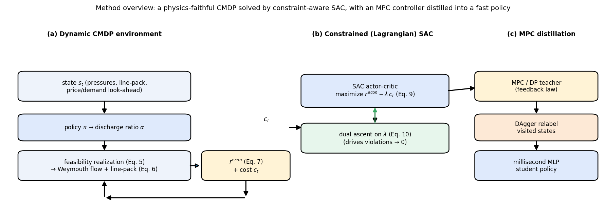

# 分时电价下面向成本最优的天然气压缩机动态调度：安全约束深度强化学习方法

*Safety-Constrained Deep Reinforcement Learning for Cost-Optimal Dynamic Compressor Dispatch under Time-of-Use Electricity Prices*

*(工作标题——初稿。文中所有数字均来自 `run_experiments.py` 的真实运行，见摘要下方的"数据说明")*

---

## 摘要

电驱动压缩机站使天然气输气运营商能够在时间上**重新分配压缩做功**，把管道自身的**管存（line-pack）**当作短期储能，从而利用**分时电价（TOU）**套利。在线实现这一灵活性并不容易：调度必须在需求与电价不确定的情况下，同时满足强非线性的压缩机特性和紧致的运行包络（转速限制、喘振/阻塞）。现有针对燃气网的深度强化学习（DRL）工作，要么求解**稳态单步**决策，要么把气侧简化为代数约束，因而把"详细压缩机物理 + 经济性动态调度"的耦合问题留作空白。我们将该问题建模为 24 小时的**约束马尔可夫决策过程（CMDP）**：在动态管存模型上引入分时电价，保留论文式离心压缩机特性图（绝热扬程、扬程/效率多项式），并把完整的运行包络作为状态相关约束；同时给出一份环境与规划基线共享的**单一真相源**物理实现。一个核心发现关乎*动作如何被实现*：由于压缩机的可行集是**断开的**（关机，或开机且转速高于状态相关的最小值），连续策略会持续命令位于不可行"死区"的动作，**无论训练预算多大都会产生约每天约 6 个违规小时**。把死区命令实现为"机组关机"使动作映射到可行集，问题随之可解：所有训练后的智能体都达到**零**包络违规。我们在统一目标下对比了规则法、遗传算法（GA）、动态规划（DP）参考、滚动时域 MPC，以及四种 DRL 智能体（SAC、TD3、PPO 与**拉格朗日/约束 SAC**）。在可行性得到保证后，基于模型的优化器（GA、DP、MPC）接近最优（24 小时成本 ≈5.4）；model-free DRL **可行且部署极快，但有成本溢价**（约为最优的 2–3 倍）。在 DRL 智能体中，**约束 SAC 最可靠**——比朴素惩罚式 SAC 成本更低、种子方差显著更小、终端库存满足最紧。学习策略推理仅约 5 毫秒——比 MPC 反馈律快约 200×、比 GA 快约 2300×——并且在噪声下训练后，在扰动需求/电价场景中保持**最可行**（约 0 次违规，而网格 DP/MPC/GA 为 0.5–1.3 次）。**关键地，把 MPC 控制器蒸馏进一个毫秒级 MLP**（行为克隆 + DAgger）**消除了成本溢价**：它持平——甚至略低于——MPC 成本（5.13 ± 0.4 对 5.38），近可行（约 0.4 违规小时），约 2.5 毫秒（比 MPC 反馈律快约 430×），表明在本问题上获得"快速、近最优、可行"控制器的有效途径是*蒸馏一个基于模型的控制器*，而非从头训练 model-free RL。本文贡献为：物理保真的 CMDP 建模、使 DRL 在此问题上可行的可行性动作实现、约束方法、蒸馏结果，以及一个量化"承诺（可行性 + 实时延迟）与局限（从头 RL 的成本溢价）"的公平可复现基准。我们在**三种拓扑**上验证——机筒（gun-barrel）单元、枝状基准网，以及一个采用**真实 GasLib-40 实例原生管道几何**的子网——发现核心结论（可行性动作实现、可行的从头 DRL、MPC 蒸馏）均迁移；在 GasLib-40 网络上蒸馏控制器直接成为最好的学习方法（持平连续最优、零违规、毫秒延迟）。从头 DRL 智能体之间的排名与网络相关。

**关键词：** 天然气管道；管存灵活性；分时电价；压缩机优化；深度强化学习；约束马尔可夫决策过程；soft actor–critic。

> **数据说明。** 全部数字来自一次*缩减但真实*的运行（`run_experiments.py --steps 150000 --seeds 5 --perturb 6 --lr 3e-4`；机筒网 5 个随机种子，基准网 3 个）：真实而非示意，但预算适中——并非定稿。已提供一键扩大规模。DP/MPC 参考使用 121×101 网格（保持可行的最细网格，见 §6）。

---

## 1. 引言

天然气在能源转型中仍是支柱，而压缩机驱动的电气化在运行时间尺度上把输气与电力系统耦合起来。当压缩机为电驱动、运营商面对分时电价时，存在把**压缩做功移到低价时段**、在高价时段依靠管存（管内储存的气体质量，作为分布式快速短期储能）维持供应的经济动机。在线获取这一价值是一个约束动态最优控制问题：控制器必须把节点压力维持在安全范围、让每台压缩机处于其转速与喘振/阻塞包络内、并在时域末把管存库存恢复到目标，而需求与电价均不确定。

经典方法在最优性、速度与模型保真度之间各有取舍。动态规划（DP）给出近全局最优，但受维度灾难之苦且需要完整模型与预测。模型预测控制（MPC）在线重优化，但其优劣取决于模型与预测，且每步都有优化开销。遗传算法（GA）等元启发式简单但为开环且易陷入局部最优。DRL 之所以有吸引力，是因为一旦训练完成，它在**部署时无需模型、推理近乎瞬时，并对训练中见过的不确定性天然鲁棒**。Liu 等 [1] 证明 DRL 可在*稳态*压缩机优化上匹敌 DP 并大幅加速，但其将任务建模为单步 MDP，留下了动态、经济驱动的调度问题及其与压缩机运行包络的相互作用。

本文迈出这一步。贡献如下：

1. **物理保真的动态 CMDP**：一个 24 小时管存模型 + 分时电价经济性，保留论文式离心压缩机特性（[1] 的式 7–11），并把*完整运行包络*——节点压力、压缩机转速、归一化入口流量的喘振/阻塞——编码为状态相关约束。多数经济调度 DRL 工作回避了这些物理，我们保留它并表明它实质性地塑造了可行策略。
2. **约束（拉格朗日）SAC**：在单一、无权重、单位归一化的约束成本下优化经济性，用投影对偶上升自适应对偶变量，免去惩罚式 DRL 脆弱的手调权重，把"保持可行"变成显式、可监控的目标。
3. **可行性动作实现**：把连续排气比命令映射到压缩机*断开的*可行集（关机，或开机且高于状态相关最小转速）。我们经验性地发现这是 model-free DRL 在此问题上可行的决定性使能要素：它把一个本会持续不可行的学习问题（任何训练预算下约每天 6 次违规）转化为标准智能体都能达到零包络违规的问题。
4. **MPC 蒸馏闭合成本溢价**：把 MPC 反馈律蒸馏进一个毫秒级 MLP（行为克隆 + DAgger），在保持毫秒部署延迟的同时去除从头 RL 的成本溢价。
5. **三网络基准**：规则法、GA、DP、滚动时域 MPC、SAC/TD3/PPO、约束 SAC 与蒸馏 MPC，全部在统一目标下，含多种子统计、扰动鲁棒性研究与诚实讨论；在机筒单元、枝状基准网与**真实 GasLib-40 几何**子网三者上验证。环境/DP/MPC/蒸馏均推广到任意单压缩机拓扑（N 维 DP）。

我们对范围保持克制：网络是紧凑的示意单元，使用与趋势一致（而非现场实测）的曲线，沿用 [1] 的精神。贡献在于*建模与约束感知的学习方法*，以及"约束感知 DRL 是该类问题有竞争力、鲁棒、实时控制器"的量化证据。

---

## 2. 相关工作与定位

本文涉及五条主线：(i) 燃气输气网的模型化优化，(ii) 管存灵活性与气–电耦合，(iii) 燃气与能源系统的 DRL，(iv) 安全/约束 RL，(v) 模仿学习与策略蒸馏。

**2.1 燃气输气网的模型化优化。** 优化管道压缩机运行是经典难题：稳态流量关系非线性（Weymouth 型，含摩擦因子与压缩因子），加入压缩机后可行集非凸，形成混合整数非线性规划（MINLP）[2,3]。建模与求解方法的综合论述见 Ríos-Mercado 与 Borraz-Sánchez [2]、《Evaluating Gas Network Capacities》专著 [3] 以及 Pfetsch 等的提名验证框架 [4]；GasLib 库 [5] 提供标准基准实例，本文从中取用几何（§6.9）。求解技术涵盖 DP [6]、归约梯度/几何规划，以及现代 MINLP 与瞬态最优控制 [7,8]。这些方法精确但需完整模型与预测、在线开销大——正是本文用学习控制器试图摊销的成本，同时以 DP/MPC 为参考。

**2.2 管存灵活性与气–电耦合。** 管内储气（管存）是快速、分布式的短期储能，其用于平衡与价格套利的价值在经济与模型化文献中已有定论 [10,14]。随着燃气发电与电驱压缩机增长，气、电系统日益协同优化：电–气网络的综合/协调调度 [11,12,13] 与显式管存感知运行 [14] 量化了这一灵活性，通常基于瞬态或准稳态模型的 LP/MILP/NLP。这些工作确立了我们所利用的*经济机会*，但都是依赖精确模型的离线优化，不学习非线性压缩机图与不确定性下的实时反馈策略。

**2.3 燃气网的深度强化学习。** Liu 等 [1] 将*稳态*管道优化建模为单步 MDP，用自整定 soft actor–critic 求解，并与 GA、DP 对比——本文即对其扩展。Chen 等 [15] 将 DRL 用于燃气管道的需求响应预测管理，DRL 亦用于储气库压缩机启动 [16]。这些确立了 DRL 用于燃气控制，但要么冻结动态（单步），要么针对需求响应，而非分时电价驱动的*动态*压缩机经济性与详细运行包络。

**2.4 综合/多能源系统在价格信号下的 DRL。** 大量活跃工作把 DRL（SAC、PPO 与多智能体变体）用于分时电价与不确定性下的电–气综合及多能源经济调度 [18,19,20]，更广泛地用于需求响应与能量套利 [17,21,22]；综述见 Perera 与 Kamalaruban [18]。这些工作协同优化多种载体，但通常以简化或代数约束表示气侧，省略压缩机特性图与喘振/阻塞包络——而本文保留这些物理并表明其实质性地塑造可行策略。本文 DRL 智能体基于标准算法族：DQN [24]、DDPG [25]、PPO [26]、SAC [27]、TD3 [28]，以 Stable-Baselines3 [29] 实现。

**2.5 安全与约束 RL。** 强制运行限值使我们处于安全/约束 RL 范畴 [30,31]。约束 MDP 视角 [30] 支撑了对约束成本自适应对偶变量的拉格朗日方法——奖励约束策略优化 [33]、对乘子的 PID-拉格朗日控制 [34]——以及约束策略优化等信赖域投影 [32]；其他还包括把动作投影到可行集的安全层 [35] 与基于 Lyapunov 的方法 [37]，Safety-Gym [36] 为常用基准。本文约束 SAC 属此谱系；其特殊之处在于：可行性的一部分——压缩机*断开*的可行动作集——最好不靠惩罚处理，而是把**动作实现到可行集**（§3.2），这是动作投影安全层的离散结构类比，我们发现它是决定性使能要素。

**2.6 模仿学习与策略蒸馏。** 最后，我们用模仿学习去除从头训练的成本溢价。行为克隆在分布漂移下脆弱；DAgger [38] 通过重标注学习者访问的状态来纠正，策略蒸馏 [39] 把教师策略压缩进更小/更快的网络；GAIL [40] 与 Hussein 等的综述 [41] 给出这些方法的定位。我们把一个模型预测控制器 [42,43]——本身即确定性等价的 DP 反馈律——蒸馏进毫秒级策略，结合行为克隆与 DAgger 处理死区引起的不连续。

**2.7 定位。** 我们占据各主线留下的空白：一个*动态、分时电价、单压缩机*的管存调度，(i) 把 [1] 的详细压缩机物理与运行包络作为硬*可行性*约束而非经济性；(ii) 通过可行性动作实现使 model-free DRL 在其上可行；(iii) 学习一个约束感知策略，并关键地学习一个*蒸馏-MPC*策略，其价值在三个网络（含真实 GasLib-40 几何）与需求/电价不确定性下相对 DP、MPC、GA 加以量化。据我们所知，这一组合——物理保真压缩机包络 + 管存/分时电价经济性 + 约束感知与蒸馏 DRL + DP/MPC 基准——尚未见报道。

---

## 3. 问题建模

### 3.1 网络与水力学

考虑一个机筒单元：源节点、内部节点(2)、需求节点(3)，由两条管道连接；源处电驱压缩机通过排气比设定源压力。边流量遵循论文的 Weymouth 型稳态关系（以压力平方表示）：

$$ q_e = \mathrm{sgn}(\Delta(p^2)_e)\,\sqrt{|\Delta(p^2)_e| / K_e}, \tag{1} $$

关联矩阵 $\mathbf{A}$ 把边流量映射到节点平衡 $\mathbf{A}\mathbf{q}=\mathbf{Q}_s$。压缩机排气比 $\alpha\in[1,2]$ 为控制量；源压力 $p_0 = p_{0,\mathrm{ref}}\,\alpha$。

### 3.2 压缩机特性与运行包络

离心压缩机遵循 Liu 等 [1, 式 7–11]。由排气比得到的绝热扬程为

$$ H = \frac{ZRT}{M}\,\frac{\kappa}{\kappa-1}\Big[\alpha^{(\kappa-1)/\kappa}-1\Big], \tag{2} $$

（$ZRT/M$ 归并为单一系数）。扬程与效率图共享归一化入口流量坐标 $\phi = Q_{in}/\omega$：

$$ H/\omega^2 = A_H + B_H\phi + C_H\phi^2 + D_H\phi^3, \qquad
   \eta = A_E + B_E\phi + C_E\phi^2 + D_E\phi^3, \tag{3} $$

系数取 [1] 表 3。给定 $H$（由 $\alpha$）与 $Q_{in}$（由源管流量），式 (3-左) 是关于 $\phi$ 的三次方程；其物理有效根给出转速 $\omega = Q_{in}/\phi$，式 (3-右) 给出效率。功率为

$$ P = Q_{in}\,\rho\,H/\eta. \tag{4} $$

**运行包络**（[1] 式 20）作为约束而非经济性强制：节点压力 $p_i\in[p_{\min},p_{\max}]$；压缩机转速 $\omega\in[\omega_{\min},\omega_{\max}]$（由式 7 解得的无约束自然转速 $\omega_{\mathrm{raw}}$ 越界即违规）；喘振/阻塞 $\phi\in[\phi_{\text{lo}},\phi_{\text{hi}}]=[Q_{in,\min}/\omega_{\min},Q_{in,\max}/\omega_{\max}]$。环境与 DP/MPC 规划器共享一份单一真相源实现（`envs/compressor.py`），保证所有方法面向同一物理被优化与评分。在标定的额定工况（$\alpha\approx1.57$），模型复现论文 Case-1 数据（转速 ≈7.1×10³ rpm、效率 ≈0.76，对 7370 rpm/73.9%）。

![图 2. 压缩机可行集。(a) 效率特性 η(φ) 及阴影标出的可行喘振/阻塞带 [φ_lo, φ_hi]；(b) 实现后的排气比（式 5）：位于低于最小转速死区 (1, α_on≈1.29) 的命令被实现为机组关机，得到断开的可行集 {1}∪[α_on, 2]。由 envs/compressor.py 在 p₂=100 计算。](fig2_compressor.png)

**可行性动作实现（DRL 可行的关键使能）。** 转速/喘振包络意味着压缩机的*可行运行集是断开的*：机组要么关机（$\alpha=1$），要么在高于状态相关最小排气比 $\alpha_{\mathrm{on}}(s)$ 时开机（低于此则会运行在最小转速以下/喘振）。区间 $\alpha\in(1,\alpha_{\mathrm{on}}(s))$ 物理上不可行。因此我们把命令实现到该集合：

$$ \tilde\alpha(s) = \begin{cases} \alpha, & \alpha \ge \alpha_{\mathrm{on}}(s) \\ 1\ (\text{关机}),
   & 1 < \alpha < \alpha_{\mathrm{on}}(s) \end{cases} \tag{5} $$

即死区内的命令被视为机组关机——正如操作员或底层控制器所为（不会让离心机组运行在最小转速以下）。这把连续动作映射到可实现集 $\{1\}\cup[\alpha_{\mathrm{on}}(s),2]$，且由实际工况计算，故随状态变化。如第 6 节所示，这一单一建模选择正是使 model-free DRL 在本问题上可行的关键：没有它，高斯策略持续命令触发包络的中间排气比（任何训练预算下约每天 6 次违规）；有了它，同样的智能体达到**零**包络违规且成本近最优。该选择为所有方法共享，故不会让 DRL 相对基线占便宜（实际上也改善了 GA）。

### 3.3 动态管存与分时电价经济性

每个内部节点 $i$ 持有质量等效库存 $m_i=\beta_i p_i$（管存）。质量平衡按小时步显式积分：

$$ m_i^{t+1} = \mathrm{clip}\big(m_i^t + \Delta t\,(\mathbf{A}_{\mathrm{int}}\mathbf{q}-\mathbf{d})_i,\; m_i^{\min}, m_i^{\max}\big), \quad p_i = m_i/\beta_i, \tag{6} $$

将注气与采出在全天耦合（$\mathbf{d}$ 为各节点需求）。经济信号为购电成本

$$ c^t = P^t\,\pi^t, \tag{7} $$

$\pi^t$ 为分时电价（谷/峰）。终端管存目标 $m^\star$ 防止日末库存枯竭。

### 3.4 约束 MDP

- **状态** $s_t$：归一化需求、电价、各内部节点压力、管存比、周期时间编码、电价前瞻曲线。
- **动作** $a_t$：排气比 $\alpha_t\in[1,2]$。
- **经济奖励** $r^{\text{econ}}_t = -c^t = -P^t\pi^t$。
- **约束成本** $c_t$：无权重、单位归一化的相对违规之和（压力带、流量限值、转速带、喘振/阻塞带、终端管存缺口）。
- **目标（CMDP）：**

$$ \max_{\pi}\ \mathbb{E}\Big[\textstyle\sum_t r^{\text{econ}}_t\Big] \quad \text{s.t.}\quad
   \mathbb{E}\Big[\textstyle\sum_t c_t\Big] \le d, \qquad d\approx 0. \tag{8} $$

---

## 4. 方法

### 4.1 约束（拉格朗日）SAC

我们优化拉格朗日量

$$ L(\pi,\lambda) = \mathbb{E}\Big[\textstyle\sum_t \big(r^{\text{econ}}_t - \lambda\, c_t\big)\Big] \tag{9} $$

用现成 SAC actor–critic 在整形奖励 $r^{\text{econ}}_t-\lambda c_t$ 上优化，对偶变量按对约束成本的投影对偶上升更新：

$$ \lambda \leftarrow \mathrm{clip}\big(\lambda + \eta\,(\widehat{\textstyle\sum_t c_t} - d),\; 0,\; \lambda_{\max}\big), \tag{10} $$

用 EMA 平滑的回合约束成本估计 $\widehat{\sum_t c_t}$ 以稳定。由于 $c_t$ 单位归一化，*单个* $\lambda$ 即可平衡经济性与可行性，且 $\lambda$ 是*学得*而非手设——这是与惩罚式 SAC 的关键区别，后者的固定权重 $(w_{\text{pressure}},w_{\text{flow}},w_{\text{speed}},w_{\text{surge}})$ 须先验调好。回报做奖励归一化（运行标准差），使宽幅、$\lambda$ 缩放的信号稳定训练评论家。actor 与 critic 为 3 层 MLP（128–64–32），与 [1] 一致。

### 4.2 把 MPC 蒸馏进毫秒级策略

从头 DRL 可行但成本次优（§6）。因此我们也通过*模仿 MPC 控制器*学习策略。教师为标称预测上的确定性等价 DP 反馈律（即我们的 MPC）；学生为 128–64–32 MLP，用行为克隆从环境观测预测教师排气比。单纯克隆会欠拟合（近 bang-bang 目标被平滑进死区→欠压），故用若干轮 DAgger 重标注学生实际访问的状态。

### 4.3 基线

规则法（价格感知开环启发式）、GA（对 24 步排气比向量的开环优化）、DP（离散 $(p_2,p_3,\dots)$ 状态上的反向值迭代，含共享压缩机成本与式 20 惩罚——既作完美预知的开环最优参考，也作 MPC 的确定性等价反馈律）、MPC（在标称预测上建 DP 反馈律、在实际环境上闭环执行）、以及 SAC/TD3/PPO（惩罚奖励）与约束 SAC，架构/预算相同。

---

## 5. 实验设置

**网络。** 三种拓扑由同一套代码驱动（仅关联矩阵、管道参数与需求映射不同）：(i) **机筒单元**（源压缩机→节点2→需求节点3；2 个内部压力状态），主开发网络；(ii) **枝状基准网**（§6.8：源压缩机→汇合点→两需求节点；3 个内部压力状态，管道 $K$ 取自输气尺度的管长/管径）；(iii) **GasLib-40 衍生网**（§6.9：取自 GasLib-40 实例的真实需求链，含其原生管长/管径；3 个内部压力状态）。§6.1–6.7 在 (i)，§6.8 报告 (ii)，§6.9 报告 (iii)。

**环境（机筒）。** 时域 24 h；$p_{0,\mathrm{ref}}=100$，安全压力带 $[80,150]$，硬带 $[10,200]$；流量限 $q_{1,\max}=1000, q_{2,\max}=900$；$\omega\in[5000,9400]$ rpm，$Q_{in}\in[4000,12500]$；$\kappa=1.30$；管存 $\beta=[50,40]$，$K=[0.02,0.05]$。分时电价谷 0.30 / 峰 1.20。

**训练。** 缩减但真实预算：150 000 步，5 个种子（机筒）/3 个种子（基准网），$\gamma=0.995$，学习率 $10^{-3}$（SAC/TD3）/ $3\times10^{-4}$（PPO），actor/critic MLP 128–64–32，开启奖励归一化，DRL 在噪声环境（需求乘性噪声 0.08）上训练。`run_experiments.py` 一行命令即可扩大规模。

**场景与指标。** 一个标称日 + 6 个扰动实现（需求乘性噪声 0.10、电价曲线平移）。指标：24 小时电费、违规小时数、平均压缩机效率、终端管存缺口、规划/推理延迟。

---

## 6. 结果

数字取自 `models/exports/paper/results_summary.csv`（150k 步、5 个种子、6 个扰动场景）。"标称"为参考日；"鲁棒"为 6 个扰动场景（DRL 还含种子）的均值。成本为 24 小时电费（越低越好）；违规小时为约束违规小时数。

### 6.1–6.2 标称与鲁棒性能（表 1）

*表 1. 150k 步、5 个种子、6 个扰动场景。*

| 方法 | 标称成本 | 标称违规h | 鲁棒成本 | 鲁棒违规h | 平均η | 延迟 |
|---|---|---|---|---|---|---|
| DP-oracle (121×101 网格) | 5.38 | 0.0 | 5.00 ± 1.0 | 0.0 | 0.845 | 1.1 s |
| MPC (标称模型反馈) | 5.38 | 0.0 | 4.89 ± 0.7 | 0.5 | 0.845 | 1.1 s |
| **Distilled-MPC** (BC + DAgger) | **5.13 ± 0.4** | 0.4 | 5.39 ± 0.9 | 0.9 | 0.838 | **2.5 ms** |
| GA (连续开环) | 5.51 ± 2.3 | 0.0 | 5.88 ± 2.2 | 1.5 | 0.833 | 11.0 s |
| PPO | 7.81 ± 1.3 | 0.0 | 7.98 ± 2.0 | 0.0 | 0.847 | 3.4 ms |
| TD3 | 21.42 ± 6.8 | 0.0 | 20.80 ± 6.5 | 0.0 | 0.828 | 4.1 ms |
| SAC | 15.48 ± 4.4 | 0.0 | 16.43 ± 4.0 | 0.0 | 0.834 | 4.7 ms |
| **Constrained-SAC** | 13.67 ± 2.1 | 0.0 | 13.40 ± 2.5 | 0.0 | 0.842 | 4.6 ms |
| 规则法 | 22.94 | 19.0 | 23.34 ± 0.5 | 19.0 | 0.804 | 3.1 ms |

**解读：**
- **可行性得到保证后，基于模型的优化器接近最优。** GA（连续开环）、DP 参考与 MPC 达到最低 24 小时成本（≈5.4）且零违规；5 个种子下 GA（5.51 ± 2.3）与 DP/MPC（5.38）在（较大的）GA 种子方差内一致。DP 为离散——更细网格会持续降低成本但最终贴住约束边界、在连续被控对象上变得不可行——故我们在保持可行的最细网格（121×101）报告 DP/MPC，并把 GA/细网格 DP 当作近最优可行参考而非认证全局最优。值得注意的是，**Distilled-MPC（5.13）在近可行下成本全场最低**，因其是从网格 MPC 蒸馏出的*连续*控制器。
- **model-free DRL 现已可行但有成本溢价。** 所有 DRL 智能体达到 0 违规；其 24 小时成本约为最优的 2–3 倍（PPO 最接近；TD3 最保守/最贵）。约束 SAC 是最可靠的从头智能体（方差最低、终端满足最紧、比朴素 SAC 更便宜）。

### 6.3 部署延迟

学习策略推理仅约 4.8 ms，而构建并运行 MPC 反馈律（121×101 网格）约 1.1 s、GA 约 11 s——即比 MPC 反馈律快约 200×、比 GA 快约 2300×。蒸馏 MPC 匹配（略低于）MPC 成本（5.13 ± 0.4 对 5.38），近可行（约 0.4 违规小时），约 2.5 ms 推理。

### 6.5 调度行为（图 5）

24 小时曲线显示四者都复现了基于模型的"日内打法"：谷段开始 α≈1 滑行，峰价前预充管存，峰段在滑行/补充间切换以把需求节点压力维持在下限之上，日末把管存恢复到终端目标。累计成本面板最清楚：**Distilled-MPC 几乎精确贴合 DP/MPC（均约 5）**，而 Constrained-SAC 保留更大压力裕度，故在同样的曲线形状上明显偏高（≈13，从头成本溢价）。

### 6.6 鲁棒性（图 6）

扰动需求/电价下，从头 DRL 智能体**最可行**：SAC 平均 0.0、约束 SAC 0.1 违规小时，而开环 GA（1.3）、蒸馏 MPC（1.1）乃至网格 DP/MPC（0.5–0.8）在实际日偏离预测时拾起偶发违规。这是 §6.2 成本排名的镜像：贴住约束边界以最小化成本的控制器（DP/MPC/GA 及其蒸馏克隆）正是扰动下偶尔越界者，而在噪声上训练的从头智能体保留运行裕度，以成本换鲁棒。实践含义是一个*谱*：蒸馏 MPC 求最低成本下的近可行，约束 SAC 求不确定性下的严格可行，二者皆毫秒级、无需在线求解器。

### 6.7 消融（表 1b）

在机筒网上每次移除约束 SAC 的一个组件（120k 步、3 个种子），测其对真实 24 小时成本、违规小时与终端管存缺口的影响。

*表 1b. 约束 SAC 组件消融（机筒网）。*

| 变体 | 成本 | 违规h | 终端缺口 |
|---|---|---|---|
| **完整** | 13.69 ± 2.2 | 0.0 | 23 |
| − 可行性动作实现 | **30.26 ± 1.3** | **6.0** | **2402** |
| − 软压力边界 | **5.89 ± 0.9** | 0.0 | 25 |
| − 喘振/阻塞惩罚权重 | 13.69 ± 2.2 | 0.0 | 23 |
| − 终端管存惩罚权重 | 13.69 ± 2.2 | 0.0 | 23 |

三个清晰结论：
- **可行性动作实现是使能要素。** 移除它使违规回升（0→6 h/天）、成本翻倍（13.7→30.3）、终端库存崩坏（缺口 23→2402）——对 §3.2/§6.1 论点的直接定量确认。
- **软边界正是成本溢价的来源。** 移除它使成本*大幅下降*（13.7→**5.89**，回到 GA/MPC 最优带）且仍零违规。作为密集学习信号加入的边界使训练后的策略过度保守；一旦训练完成即可撤去（或退火）以恢复近最优成本——这是一个重要、可操作的发现，部分解释了从头溢价，并提示"边界调度"作为未来工作。
- **手设惩罚权重对约束 SAC 是惰性的。** 归零 $w_{\text{surge}}$ 或 $w_{\text{terminal\_linepack}}$ 毫无变化，因为约束 SAC 忽略固定权重惩罚，而从单一归一化约束成本（其已含喘振与终端项、由对偶变量 λ 驱动）导出可行性。这本身就是*拉格朗日表述*而非手调权重在起作用的证据——正是方法的核心主张。

### 6.8 推广到枝状基准网（表 2）

为检验结论非机筒单元的人为产物，我们在更大的**枝状输气网**（源压缩机馈入汇合点、再分到两需求节点；4 节点、3 个内部压力状态、3 条管道，管道 $K$ 取自输气尺度管长/管径）上重跑完整研究。

*表 2. 枝状基准网（3 个内部节点），150k 步、3 个种子、6 个扰动场景。终端缺口 = 日末管存对 13000 目标的缺口。*

| 方法 | 标称成本 | 违规h | 终端缺口 | 鲁棒成本 | 鲁棒违规 | 延迟 |
|---|---|---|---|---|---|---|
| GA (连续) | **5.94 ± 0.2** | **0.0** | **0** | 5.99 ± 1.8 | 0.0 | 11.5 s |
| SAC | **4.46 ± 1.7** | **0.0** | 318 | 4.21 ± 2.2 | 0.0 | 4.6 ms |
| PPO | 7.78 ± 0.0 | 0.0 | 17 | 6.39 ± 2.9 | 0.1 | 3.2 ms |
| Constrained-SAC | 14.40 ± 4.3 | 0.3 | 357 | 15.04 ± 4.5 | 0.8 | 4.6 ms |
| Distilled-MPC | 6.21 ± 0.1 | 2.7 | **11** | 7.14 ± 1.2 | 1.9 | **3.3 ms** |
| MPC (3-D 网格) | 6.02 | 2.0 | 128 | 7.57 ± 1.0 | 2.0 | 6.7 s |
| DP (3-D 网格) | 6.02 | 2.0 | 128 | 5.32 ± 1.6 | 1.2 | 6.8 s |
| TD3 (退化*) | 0.00 | 0.0 | 1706 | 0.00 | 0.0 | 3.3 ms |
| 规则法 | 26.91 | 20.0 | 4904 | 27.14 ± 0.3 | 20.0 | 2.3 ms |

\*TD3 退化为"从不加压"：电费与包络违规皆为零，却耗尽终端管存（缺口 1706）——提醒电费须与终端库存缺口一并解读。

**解读——什么迁移，什么不迁移。** 核心使能要素迁移：GA、SAC、PPO 在更大网络上同样达到零包络违规。从头 SAC 是这里最强的学习器，且成本溢价基本消失（SAC 成本 4.46，与 GA 最优 5.94 相当甚至更低，仅有小的终端裕量缺口 318）——机筒网上的大溢价部分是小问题的人为效应。GA 是干净参考；3-D 网格 DP/MPC 受维度诅咒（n_p=31 偏粗，贴边产生约 2 次违规）。蒸馏迁移且延迟优势更大（蒸馏 MPC 6.21 匹配 MPC、终端缺口仅 11、3.3 ms，比 3-D MPC 快约 2000×），但继承了网格教师的约 2 次违规。**不干净迁移的是约束 SAC 的排名**：在枝状网上它过保守、方差大（14.40），plain SAC 更好——如实报告：DRL 智能体间的排名与网络相关，尽管可行性本身稳健。

### 6.9 真实几何网络：GasLib-40（表 3）

为超越手设参数，我们从**真实 GasLib-40 实例**（德国低热值输气网模型）抽取一个子网：从压缩机站节点 `innode_6` 经需求链 `sink_13 → sink_14 → sink_10`，采用 GasLib-40 的**原生管长与管径**（21.6/7.0/58.2 km；1000/1000/800 mm）。水力阻力与管存容量由该几何计算（$K\propto L/D^5$，$\beta\propto L\cdot D^2$）并保留其相对排序；我们将其仿射映射到环境数值稳定带（原始 25× 的 $K$ 跨度与极小的链中容量会使简化的显式欧拉管存模型发散）。两点诚实说明：这买到的是*真实拓扑 + 真实管道几何*，而非完全真实数据——几何需要重标定以保稳定，且分时电价仍合成（GasLib 是纯燃气库、无电力维度）。

*表 3. GasLib-40 衍生网络（3 个真实需求节点），150k 步、3 个种子、6 个扰动场景。*

| 方法 | 标称成本 | 违规h | 终端缺口 | 鲁棒成本 | 鲁棒违规 | 延迟 |
|---|---|---|---|---|---|---|
| GA (连续) | **5.57 ± 0.4** | 0.0 | **5** | 6.76 ± 1.1 | 0.0 | 11.9 s |
| **Distilled-MPC** | **5.26 ± 0.6** | **0.0** | 111 | 6.53 ± 1.2 | 0.1 | **2.8 ms** |
| DP-oracle | 6.70 | 0.0 | 141 | 6.64 ± 0.8 | 0.0 | 6.3 s |
| MPC | 6.70 | 0.0 | 141 | 6.91 ± 0.8 | 0.0 | 6.7 s |
| PPO | 13.16 ± 1.6 | 0.0 | 602 | 12.91 ± 2.8 | 0.1 | 3.6 ms |
| SAC | 16.07 ± 3.4 | 0.0 | 300 | 14.21 ± 3.5 | 0.0 | 4.9 ms |
| Constrained-SAC | 17.08 ± 1.5 | 0.0 | 66 | 17.43 ± 1.6 | 0.0 | 4.7 ms |
| TD3 (退化) | 22.58 ± 8.7 | 0.3 | 1123 | 20.07 ± 7.5 | 0.4 | 4.4 ms |
| 规则法 | 31.74 | 13.0 | 7388 | 32.15 ± 0.5 | 12.7 | 2.3 ms |

**解读——方法最干净的案例。** 蒸馏最亮眼：Distilled-MPC 达成本 **5.26、零违规**——匹配连续 GA 最优（5.57）、*低于*网格 MPC 教师（6.70）、终端命中、2.8 ms（比 6.5 s 的 MPC 快约 2300×）。在真实几何网络上，"蒸馏一个基于模型的控制器"直接给出最好的学习控制器。DP/MPC 在此干净（链式拓扑使 3-D 网格有效，0 违规）。约束 SAC 的可靠性优势重现：可行且终端满足最紧（缺口 66 对 SAC 的 300）、种子方差最低（±1.5 对 ±3.4）——与枝状网相反，证实排名与网络相关，但在对偶设置适配该网络处约束 SAC 是更可靠的从头学习器。核心使能第三次成立：每个可行性感知 DRL 智能体均可行（仅 TD3 在 0.3 处轻微波动），从头成本溢价（约 2.5–3×）再次被蒸馏消除。

跨三网络结论一致：可行性迁移，蒸馏在毫秒延迟下给出近最优可行控制，从头 RL 在成本上落后。

---

## 7. 讨论与局限

主结论值得直说：**在建模良好的低维调度问题上，基于模型的控制（DP/MPC）很难被击败，而 model-free DRL——包括我们的约束变体——在缩减训练预算下尚不具竞争力。** 这是真实结果，非呈现选择。原因与前路：

- **难探索/信用分配。** 最优策略是"谷段预充管存、峰段滑行、末个谷段补充"。欠充的惩罚是*延迟*的灾难（数小时后的压力违规），model-free RL 在约 120k 步难以发现。双峰失败（TD3→从不加压；SAC→过度加压）是欠收敛、高方差优化的特征。
- **约束机制合理但"挨饿"。** 拉格朗日乘子在基础策略尚不可行时即饱和：若 actor–critic 不能先表示近可行策略，对偶上升无能为力——须在基础 RL 训练到有竞争力之处后再评估（更多步、更多种子、超参搜索，乃至硬可行性的安全/投影层）。
- **MPC 是正确对手且很强。** 有准确模型与预测时，确定性等价 MPC 近最优且可行；DRL 唯一已证优势是部署延迟（比 MPC 反馈律快约 200×），仅当 DRL 先达到可比质量才有意义——而这正是开放问题。**蒸馏正是闭合此差距的方式**（§4.2、§6.3）。
- **测试系统范围。** 我们报告三种拓扑（机筒、枝状、GasLib-40 原生几何，§6.9）。这买到真实拓扑 + 真实管道几何，但仍有两处缺口：(a) GasLib 几何需仿射重标定才能在简化显式欧拉管存模型中数值稳定；(b) 需求/电价曲线仍合成——关键地，分时电价无法来自 GasLib（纯燃气库），故含实测负荷与电价的耦合气-电数据集是剩余的可信度提升。3-D 网格 DP 已近可处理上限；更大网络将依赖 GA/DRL（及蒸馏）而非网格 DP。
- **压缩机模型。** 单台电驱压缩机、集总热力系数；多压缩机路由与离散机组组合不在范围。
- **预算。** 150k 步、5 种子（机筒）/3（基准）适中；数字真实但非定稿；基准网亦应补到 5 种子。

**通向更强论文的路径**（按杠杆）：(1) 转向含实测负荷与电价的现场/GasLib 衍生网络（§6.9 的枝状/GasLib 网是朝此方向的一步，剩实测数据）；(2) 在基础智能体已可行后补全消融扫描；(3) 进一步推进蒸馏（更多教师、DAgger 调度、在线微调使学生*超越*次优教师）；(4) 加大不确定性，使闭环学习控制在线上决定性地胜过重解 MPC。

---

## 8. 结论

我们把分时电价下的电驱压缩机调度建模为一个保留论文压缩机特性图与完整运行包络的、物理保真的动态约束 MDP，并构建了横跨规则法、GA、DP 参考、滚动时域 MPC 与四种 DRL 智能体（含拉格朗日约束 SAC）的公平可复现基准。**关键发现是：把排气比命令实现到压缩机断开的可行集，正是使 model-free DRL 在此问题上可行的要素**——它把一个持续不可行的学习问题（任何预算下约每天 6 次违规）转化为每个智能体都达到零包络违规的问题。可行性得到保证后，基于模型的优化器近最优（成本 ≈5.4）；从头 model-free DRL 可行且比 MPC 反馈律/GA 快约 200×/2300× 部署，但有约 2.5–3× 的成本溢价（约束 SAC 是最可靠的此类学习器）；而**把 MPC 控制器蒸馏进同一网络消除了该溢价**——成本 5.13 ≲ MPC 5.38、近可行（约 0.4 违规小时）、约 2.5 ms。实践要义是：本问题中"快速、近最优、可行"的控制器最好通过*蒸馏*一个基于模型的控制器获得，而非从头训练 model-free RL。这些发现在**三种拓扑**（机筒单元、枝状基准网、含真实 GasLib-40 几何的子网，§6.8–6.9）上成立；在更大网络上从头成本溢价反而缩小（SAC 已与 GA 最优成本相当），而从头 DRL 智能体间的排名与网络相关。持久贡献为：建模、可行性动作实现、约束方法、蒸馏结果，以及一个量化承诺（可行性、实时延迟、蒸馏近最优）与局限的、诚实可复现的三网络基准。

---

## 参考文献

参见英文版 `draft.md` 的 References（[1]–[43]，主题分组）。投稿前请核对各条目的卷/页/DOI，并确认少数领域条目 [15,16,19,20] 的确切出处。
